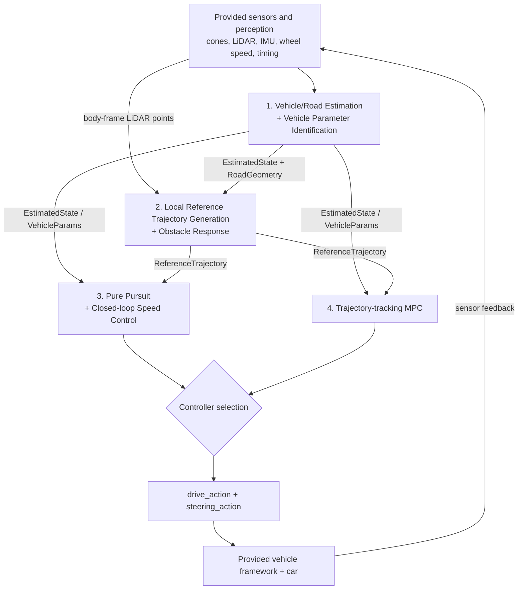
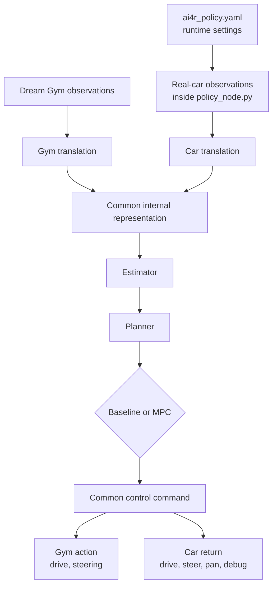

# AI for Robotics System Project — Team Project Plan

**Team:** Kid  
**Purpose:** A concise execution plan for what we are building, who owns each subsystem, how the subsystems connect, how we will validate them, and how team progress will be recorded.

> **Working document:** Subteam allocation and interfaces are initial decisions, not permanent constraints. We will review them after Stage 0 and after teaching-team feedback if workload or technical scope proves unbalanced.

---

## 1. Project Goal, Scope, and Success Levels

### Overall goal

Develop, integrate, and evaluate an autonomous 1:10 vehicle system that can follow a cone-defined curved road at an appropriate speed and respond safely to obstacles without manual driving. We will use the provided sensing, perception, ROS, and vehicle framework, and compare a reliable baseline controller with a model-based predictive controller.

### System success levels and parallel investigation

| Level | Goal | Success criterion |
|---|---|---|
| **System MVP** | Follow a cone-defined curved track using road/state estimation, a local reference trajectory, Pure Pursuit, and closed-loop speed control. | End-to-end pipeline runs without manual control, produces valid actions, and completes a representative curved-track test safely. |
| **System Target** | Add obstacle-aware local behaviour and validate the integrated baseline on the real car. | The system distinguishes relevant from irrelevant obstacles and produces a safe response, supported by simulation and real-car evidence. |
| **Parallel Core Investigation** | Develop trajectory-tracking MPC in simulation and compare it with the baseline under matched conditions. | MPC produces valid control actions and the team can explain measured tracking, smoothness, robustness, constraint, and computation-time trade-offs. |
| **Planned Extension** | Validate MPC on the real car if runtime and safety conditions allow. | Real-car MPC uses the shared controller interface and is supported by controlled runtime and behaviour evidence. |
| **Optional Stretch** | Investigate MPCC or another evidence-based MPC extension. | Attempted only after trajectory-tracking MPC works reliably. |

### Scope boundaries

**In scope:** road/vehicle state estimation; vehicle parameter identification; local reference trajectory generation; obstacle response; Pure Pursuit and closed-loop speed control; trajectory-tracking MPC; simulation/replay studies; controlled real-car experiments; quantitative comparison.

**Out of scope:** SLAM/global mapping; global route planning; rebuilding provided camera/LiDAR/IMU/vehicle nodes; physical modification of the car; a permanent simulation/integration-only subteam; starting directly with MPCC.

### Working assumptions

- Cone detections, LiDAR, wheel speed, IMU, timing, and the vehicle interface are supplied by the starter framework.
- Default policy frame: `base_link`, with `+x` forward, `+y` left, `+z` up.
- Downstream teams use documented mock/noisy inputs when upstream work is incomplete.
- Numerical pass thresholds will be set after Stage 0 using representative data.

---

## 2. System Architecture and Shared Interfaces

### 2.1 Conceptual architecture

**Important:** Pure Pursuit/PID and MPC are alternative implementations of the same control block; they are not in series.

### 2.2 Implementation view

The translation layers are conceptual mappings, not a requirement to create separate adapter files. The real-car student implementation remains in the single provided `policy_node.py`. The four subsystems are logical modules rather than four separate ROS nodes.

### 2.3 Interface draft v0.2 — not yet frozen

| Interface | Producer | Consumer | Minimum contents | Representation / convention | Timing / validity |
|---|---|---|---|---|---|
| Common sensor observations | Gym or car translation | Estimation / Planning | cones, wheel speed, IMU, body-frame LiDAR, `dt`, measurement age/availability | translation normalises source names, colour IDs, padding, and no-return semantics | each policy step; source age retained |
| `EstimatedState` | Estimation | Planning + controllers | speed, yaw rate, lateral error, heading error, confidence, timestamp/age | structured record; local/body-relative quantities; SI units | produced from the latest valid observations; stale limit fixed at M0 |
| `RoadGeometry` | Estimation | Planning | filtered left/right boundaries or stable centreline, valid forward range, lane width, confidence, timestamp/age | ordered `N×2` points or agreed spline in `base_link`; exact form fixed at M0 | updated from valid cone observations; validity horizon fixed at M0 |
| `VehicleParams` | Identification | controllers | steering relationship/offset, effective wheelbase, drive response, delay/limits | structured record; SI units | static per calibrated vehicle/configuration |
| `ReferenceTrajectory` | Planning | controllers | `x`, `y`, heading, curvature, `v_ref`, obstacle/stop state, confidence, timestamp, and progress or relative-time index | aligned arrays in the agreed local frame; parameterised by `s_m` or `t_rel_s` | regenerated at planner rate; expiry fixed at M0 |
| `ControllerOutput` | selected controller | starter framework | `drive_action`, `steering_action`, `camera_pan_action=None`, `debug1`, `debug2` | actions normalised to `[-1, 1]`; debug fields are diagnostic scalars only | one finite output per policy step |

**Shared conventions:** `drive_action` is motor effort, not target speed; `steering_action` is normalised steering position, not radians; physical wheel speed is unsigned; `None` means unavailable/expired data, not measured zero; use actual `dt`; define behaviour for empty/stale/invalid/low-confidence inputs; student policy code must not block the policy loop. Any body-frame geometry is tied to its observation timestamp because `base_link` moves with the car.

Before M0 freeze, each interface must finalise its Python type/shape, producer and consumer rate, required/optional fields, freshness limit, invalid-data behaviour, and one example record. `ReferenceTrajectory` parameterisation (`s_m` or `t_rel_s`) and the MPC state representation remain open design decisions, but they must be mutually consistent before MPC integration.

Any interface change must be agreed by both producer and consumer before merge.

### 2.4 Runtime contract — must be frozen at M0

The starter currently defaults to cone-triggered execution. `policy_update_rate_hz` applies only in timer mode; more policy steps do not create new sensor measurements.

| Runtime item | Baseline | MPC |
|---|---|---|
| update trigger and rate | decide and record before M0 | decide and record before M0 |
| exact `required_sensors` | decide and record before M0 | decide and record before M0 |
| sensor timeout / empty-cone behaviour | decide and test before Stage 0 completion | decide and test before MPC integration |
| stale-data response and explicit state-3 recovery | document and test | document and test |
| controller selection | one documented configuration selects baseline | one documented configuration selects MPC |
| diagnostic evidence | actions, errors, runtime, configuration | actions, errors, solver status/time, configuration |

Matched baseline/MPC comparisons use the same road, initial conditions, reference, sensor conditions, and evaluation metrics. Any difference in update mode or rate must be reported and justified.

### 2.5 Stop, braking, and recovery contract

- Planning owns obstacle relevance and outputs a stop request and/or zero-speed reference.
- The selected controller owns braking action, stopped-state detection, stop latching, and release/recovery behaviour.
- `drive_action = 0` removes motor effort; it does not prove that the moving car has stopped.
- Negative drive acts as braking in the current Dream Gym direction-latch model, but this is a simulation hypothesis until verified safely on the physical car.
- Missing/stale required sensors cause the framework to publish zero commands; recovery requires an explicit state-3 request.
- Predicted trajectories, solver status, and detailed experiment logs are internal evidence, not additional fields in the five-value car action return.

---

## 3. Subteam Responsibilities

### 3.1 Vehicle/Road State Estimation + Vehicle Parameter Identification

**Members**
- **Yiming Zhang — estimation/sensor-fusion lead:** filtering, multi-rate observations, road-relative state.
- **Zhengxi Chen — vehicle-identification/implementation lead:** controlled parameter experiments, model validation, ROS/simulation support.

**Purpose:** Convert noisy/intermittent observations into a stable estimate of the vehicle state and forward road geometry, and identify physical parameters required by planning/control.

**Inputs:** cones, wheel speed, IMU, sensor age, actual `dt`, experiment logs.  
**Outputs:** `EstimatedState`, `RoadGeometry`, `VehicleParams`.

**Owns:** filtering and temporal consistency; cone association; stable boundary/centreline reconstruction; vehicle-state definition; sensor characterisation; physical parameter identification and uncertainty.  
**Does not own:** cone detection, choosing where to drive within the estimated road, controller tuning, MPC cost/constraints, vehicle actuation.

**Deliverables:**
- MVP: documented `EstimatedState` and `RoadGeometry` interfaces + stable estimates on representative noisy data.
- Target: repeatable real-car parameter-identification results with variability/uncertainty.
- Stretch: short-gap prediction and explicit measurement-age handling.

**Validation question:** Does estimation produce stable vehicle and forward-road estimates without adding unacceptable lag for planning/control?

**Boundary rule:** Estimation reconstructs what the road is; Planning decides where within that road the vehicle should go.

### 3.2 Local Reference Trajectory Generation + Obstacle Response

**Members**
- **Xinkai Zhang — trajectory/integration lead:** local trajectory generation, geometry, planner interfaces.
- **YueShan Li — algorithm/evaluation lead:** alternative local-planning strategies, obstacle logic, controlled comparison.

**Purpose:** Decide **where the vehicle should go locally** and provide a smooth, feasible reference to either controller.

**Inputs:** `EstimatedState`, `RoadGeometry`, body-frame LiDAR points, vehicle footprint/limits, current speed.  
**Output:** `ReferenceTrajectory`.

**Owns:** local reference generation; smoothing/look-ahead; curvature/speed feasibility; path-corridor checks; obstacle-aware stop or local path adjustment.  
**Does not own:** cone detection, SLAM/global planning, state filtering, low-level control, MPC optimisation.

**Deliverables:**
- MVP: smooth local reference from estimated road geometry.
- Target: distinguish obstacles inside the planned corridor from irrelevant roadside returns and respond safely.
- Stretch: compare safe stopping with feasible local path deformation.

**Validation question:** Can the planner produce a smooth feasible reference and react only to obstacles relevant to that reference?

### 3.3 Pure Pursuit + Closed-loop Speed Control

**Members**
- **Yifan Wu — baseline-control/system-integration lead:** Pure Pursuit, speed-control structure, hardware integration.
- **JiaHao Ni — implementation/testing lead:** controller implementation, experiment automation, debugging, evidence generation.

**Purpose:** Close the end-to-end loop early with a reliable controller and provide the comparison baseline for MPC.

**Inputs:** `EstimatedState`, `ReferenceTrajectory`, `VehicleParams`, wheel speed, actual `dt`.  
**Output:** `drive_action`, `steering_action`, debug/log values.

**Owns:** Pure Pursuit geometry and look-ahead; PID/PI speed control; saturation/anti-windup; baseline tuning; safe fallback.  
**Does not own:** road estimation, obstacle/path decisions, physical parameter identification, MPC.

**Deliverables:**
- MVP: Pure Pursuit + working low-speed closed-loop speed control in simulation.
- Target: stable real-car baseline with documented tuning and failure cases.
- Stretch: evidence-based gain scheduling or speed/look-ahead adaptation.

**Validation question:** How do look-ahead and speed-control gains affect tracking, speed regulation, and smoothness?

### 3.4 Model Predictive Control

**Members**
- **Yuzaiyang Fan — optimisation and solver:** focuses on MPC formulation, solver implementation, and numerical optimisation.
- **Zhenyu Zhang — prediction-model and real-time deployment:** focuses on vehicle modelling, discretisation, and real-time implementation on the car.
- **Ying Xu — objective design, constraints, and evaluation:** focuses on MPC objectives and constraints, controller tuning/evaluation, and coordination with estimation and planning.

**Purpose:** Implement a constrained model-based alternative to the baseline controller and study the trade-off between tracking performance, control smoothness/constraint satisfaction, robustness, and real-time computation.

**Inputs:** `EstimatedState`, `ReferenceTrajectory`, `VehicleParams`, actual `dt`, measurement age, actuator limits.  
**Output:** the same `ControllerOutput` action interface as baseline. Solver status, solve time, predicted trajectory, objective terms, and experiment logs are retained as internal diagnostic evidence.

**Owns:** prediction-model use/discretisation; MPC state representation; MPC objective and reference-error definitions; alignment of `ReferenceTrajectory` samples with the prediction horizon; state/input/rate constraints; horizon and update-rate choices; solver integration; real-time behaviour; tuning; and controlled baseline comparison.  
**Does not own:** physical parameter identification, reference-trajectory generation, SLAM, or obstacle-path decisions. MPC tracks the planner output; MPCC remains a stretch option only.

**Deliverables:**
- **Core deliverable:** trajectory-tracking MPC that runs reliably in simulation, with a documented model, objective, constraints, reference construction, and solver timing/status.
- **Planned hardware validation:** deploy and compare MPC on the real car if runtime and safety conditions allow.
- **Optional extension:** MPCC feasibility study or another evidence-based MPC extension after the core deliverable is complete.

**Validation question:** How do objective/constraint design, horizon, update rate, model complexity, and solver choices affect tracking, smoothness, robustness, constraint behaviour, and computation time?

Each member must retain personally explainable evidence of their technical design, simulation investigation, and a relevant real-car investigation. Shared experiments are allowed, but every member must be able to explain their own technical contribution and interpretation. Coordination work is additional evidence, not a substitute for technical ownership.

---

## 4. Development and Integration Plan

The detailed task owner and exact due date live in Microsoft Planner. This plan keeps only the major project gates:

- **Before the Week 11 check-in:** M0–M2 complete.
- **Before the first hardware comparison:** baseline stable and runtime/safety contract tested.
- **Before the assessment period:** final experiment and evidence freeze complete.

| Milestone | Main outcome | Definition of done |
|---|---|---|
| **M0 — Interface + runtime freeze** | Interface draft v0.2 and runtime settings agreed | Exact example records, types/shapes, rates, freshness/invalid rules, trigger, required sensors, and recovery are recorded; every team can work from mocks |
| **M1 — Stage 0: Integration Skeleton** | Full low-performance pipeline runs | Translation → simple estimator/road geometry → simple reference → simple baseline → finite normalised actions; invalid data follows the agreed fallback |
| **M2 — Subsystem prototypes** | Every subteam has an independently testable implementation | Each subsystem runs in simulation/replay with at least one meaningful comparison/sensitivity test |
| **M3 — Baseline simulation integration** | System MVP works in simulation | Saved metrics, plots, logs, and failure cases |
| **M4 — Baseline real-car validation** | Integrated baseline is characterised on hardware | Runtime/safety contract tested and matched real-car conditions recorded |
| **M5 — Obstacle behaviour** | System Target obstacle response integrated | Relevant/irrelevant obstacle cases tested safely |
| **M6 — MPC core validation** | MPC runs through the shared interface in simulation | Solver timing fits the selected control budget; matched baseline comparison saved |
| **M7 — Planned MPC hardware validation** | MPC tested on the real car if runtime/safety gates pass | Controlled behaviour and runtime evidence saved, or a justified limitation recorded |
| **M8 — Final evidence freeze** | Evidence is assessment-ready | Subsystem evidence, comparisons, diagrams, plots, videos, limitations, and decisions complete |

### Stage 0 rules

- Stage 0 tests **integration, not performance**.
- Each subteam provides the smallest implementation satisfying its output contract.
- Baseline closes the first end-to-end loop; MPC develops in parallel against the same mocked interfaces.
- No team waits for an upstream subsystem to be “finished”; use documented mock/noisy inputs.

---

## 5. Testing, Evidence, and Team Working Rhythm

### Testing strategy

Each important claim should answer a clear engineering question and be supported by simulation/replay and controlled real-car evidence relevant to the member's own technical work.

| Subsystem | Main simulation/replay study | Main real-car evidence |
|---|---|---|
| Estimation / Identification | noise, dropout, delay, parameter mismatch | sensor characterisation + repeatable parameter tests |
| Planning / Obstacle | curvature, missing cones, obstacle position, LiDAR noise | repeatable safe obstacle cases |
| Baseline | look-ahead/gain sweeps on shared roads | matched low-speed tracking runs |
| MPC | horizon/weight/rate sweeps under noise/delay/model mismatch | matched runs vs baseline when solver timing is safe |

**Core system evidence:** completion/collision outcome; tracking and speed error; obstacle clearance/false stops; control smoothness; planner/controller runtime; failure reason and recovery behaviour. Every reported plot/table records units, configuration, test conditions, and number of runs.

### Collaboration and source of truth

| Tool | Use |
|---|---|
| **Microsoft Teams** | official communication, meetings, blockers, interface discussion |
| **Microsoft Planner** | task owner, status, due date, definition of done, evidence link |
| **GitLab** | source of truth for code/configuration/technical Markdown |
| **Weekly Teamwork Document** | individual commitments, follow-through, blockers, hand-offs, collaboration evidence |
| **Decision Log** | important alternatives, decisions, reasons, and impact |

**Weekly rhythm:** before the full-team meeting, each member updates Planner and their weekly record; each subteam reports completed work/evidence, blocker/interface change, and next commitment; the whole team resolves shared decisions; everyone leaves with at least one specific and verifiable technical commitment. Integration is tested continuously rather than postponed to the end.

For major cross-subteam engineering decisions, the team uses a lightweight weighted decision matrix or another agreed formal method, then records the alternatives, criteria, result, assumptions, and impact in the Decision Log. This is used for decisions such as update trigger, reference representation, MPC solver, and obstacle-response strategy, not for routine implementation details.

**Important:** coordination/service work counts as teamwork evidence but does not replace each member's substantive technical contribution.

---

## 6. Open Risks and Teaching Questions

### Main risks

| Risk | Mitigation |
|---|---|
| Interface drift | freeze the v0.2 draft at M0; example data; producer + consumer review |
| Multi-rate/stale data | actual `dt`, sensor age, availability checks, delay/noise tests |
| Sparse low-speed wheel-speed data | characterise sensor; conservative tuning; document limitations |
| MPC blocks policy loop | measure runtime immediately; control horizon/model complexity; keep baseline fallback |
| Obstacle scope expands | corridor detection + safe stop first; path deformation second |
| Limited hardware time | prepare simulation/replay and a written run sheet before car sessions |
| Evidence lost late | save configs, logs, plots, videos, decisions, and failed results continuously |

### Teaching questions

| Question | Owner |
|---|---|
| Is safe stopping an acceptable target obstacle response, or is active avoidance expected for our stated goal? | Planning |
| What ground-truth/external measurement method is available for real-car tracking-error evaluation? | Estimation |
| Which optimisation packages/solver versions are available on the car, and what runtime constraints should MPC assume? | MPC |
| What track/obstacle arrangements can be repeated for controlled evidence collection? | Ying Xu / whole team |
| May helper functions/classes be defined elsewhere within `policy_node.py`, or should all student implementation remain inside the insertion block? | Coding steward |

---

## Appendix A — Key Architectural Decisions

- Four technical subteams, initial composition `2 + 2 + 2 + 3`.
- The initial three-person subteam is MPC: Ying Xu, Yuzaiyang Fan, Zhenyu Zhang. Its scope is deliberately split into prediction-model/deployment, optimisation/solver, and objective/constraints/reference/evaluation ownership so that all three members have substantive technical work.
- Local road-relative estimation/planning; no SLAM.
- Baseline and MPC are alternative controllers behind one shared interface.
- Estimation owns measured physical parameters; MPC owns how they are used in its prediction model.
- Estimation reconstructs `EstimatedState` and `RoadGeometry`; Planning uses them to choose `ReferenceTrajectory`.
- Planner owns **where to go**; controllers own **how to follow it**.
- MPC simulation and matched comparison are parallel core work; hardware validation is planned subject to runtime/safety gates; MPCC is optional stretch only.
- Simulation is used by every subteam rather than owned by a simulation-only team.

## Appendix B — Decision Log

| Date | Decision | Alternatives considered | Reason / impact |
|---|---|---|---|
| 2026-09-30 | Four subteams: Estimation, Planning, Baseline, MPC | perception team; simulation-only team; fewer larger teams | clear technical ownership and system interfaces |
| 2026-09-30 | Initial `2+2+2+3`, with three people in MPC | three people in Estimation; other reallocations | MPC has separable model/deployment, solver/optimisation, and objective/constraints/reference/evaluation ownership, giving each member substantive technical evidence |
| 2026-09-30 | Trajectory-tracking MPC before MPCC | direct MPCC | separates planner/controller responsibilities and reduces integration risk |
| 2026-09-30 | Shared baseline/MPC controller contract | controller-specific planner output | fair comparison + easy fallback |
| 2026-09-30 | Stage 0 before deep optimisation | late integration | exposes interface/deployment problems early |
| 2026-09-30 | Separate `EstimatedState` from `RoadGeometry` | one combined scalar state | preserves forward road structure for Planning and clarifies ownership |
| 2026-09-30 | Treat MPC simulation/comparison as parallel core work | label all MPC work as system stretch | protects MPC technical progress without making hardware MPC a system critical path |
